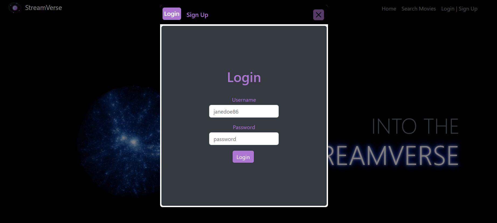

# Stream Verse

## Description

The StreamVerse app allows the user to access, rate, and add movies to different lists (e.g., watched movies and movies to watch). After login, users can view their bio, saved movie list, and to be watched lists on their own dashboard. When a user searches a movie, they can rate it and save it to their watched list or just add it to their want to watch list. Users can add view friends' recent updates by clicking on their profile in in their friend list. 

## Table of Contents
* [Installation](#installation)
* [Usage](#usage)
* [Screenshots](#screenshots)
* [Technologies-Used](#technologies-used)
* [Credits](#credits)
* [License](#license)
* [Questions](#questions)

## Installation

If you want to clone this repository make sure to npm install all of our amazing packages! Some of the packages included, but not limited to: mongoose, graphQL, apollo server, material UI.

## Usage

To use our app follow [Heroku](this link) to our deployed page on Heroku.

## Screenshots

 

# Technologies-Used

* Mongo DB
* Express
* React
* Node

## Credits
Thanks to this amazing group for making this app possible!

[Ashley](https://github.com/Ashleyg5),
[Emily](https://github.com/emilymclean94),
[Ethan](https://github.com/EGARRISXN),
[Keely](https://github.com/keelyybug),
[Sami](https://github.com/sweetkloid)

## Questions
If you have any questions don't hesitate to contact us with the information listed below.

You can find our GitHub here: [GitHub](https://github.com/emilymclean94/movie-nova)